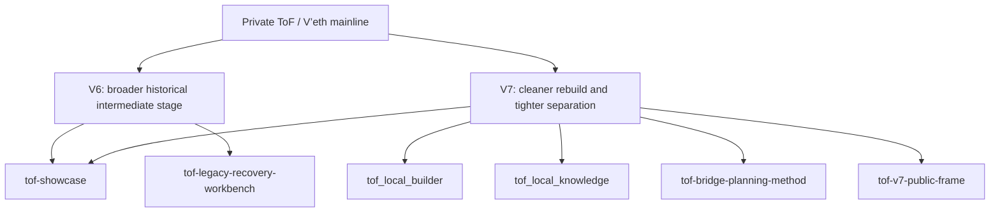

# Project Line and Public Repo Family

> English is the primary text in this document. A German mirror is available in `06_project-line_DE.md`.

This document explains how the public repositories relate to the larger private ToF / V’eth main project line.

> This page explains system context and repo relationships. For concrete product combinations, see `01_product_line.md`.

## Why this page exists

A public repository can easily look either too abstract or too small if the broader context stays invisible.

This page exists to show that the public repositories are not random fragments. They are deliberate, public-safe slices of a larger private system line.

## Main project line

The broader ToF / V’eth line is developed privately.

Publicly, the project should be read as a larger system line with:

- architecture work
- runtime iteration
- separation of layers and spaces
- smoke and verification culture
- staged development across older and newer versions
- controlled public framing instead of raw internal disclosure

## Private line, public slices

The public repositories are not meant to mirror the whole internal system one-to-one.

Instead, they expose selected slices that can be shown safely and explained honestly:

- `tof-showcase` = broad public architectural reading and project entry point
- `tof_local_builder` = public local builder slice for local GUI-first building workflows
- `tof_local_knowledge` = public on-prem knowledge slice for indexing, search, and grounded answers
- `tof-legacy-recovery-workbench` = public recovery/workbench method slice for older mixed material
- `tof-bridge-planning-method` = public bridge-planning slice between prepared blocks and later target candidates
- `tof-v7-public-frame` = reduced V7 boundary frame with stronger separation emphasis

## Reading the version line

A useful public reading is:

- **V6** = broader historical intermediate stage with more operational width and accumulated experiments
- **V7** = cleaner rebuild with stronger separation, tighter system reading, and clearer public framing

This does not mean that public repositories expose the full private runtime of either version.

It means the public side is derived from a real project line with real evolution.

## Public growth path

Two public repositories are expected to keep growing in visible practical depth:

- `tof_local_builder`
- `tof_local_knowledge`

These two repositories are the clearest public places for showing runnable local-first substance.

They should therefore be read as active public build-out spaces, not as frozen snapshots.

## Public-safe diagram

## Important boundary

This page does **not** claim that the public repositories are the whole system.

It shows a safer and more honest reading:

- there is a larger private main project line
- the public repositories are deliberate slices
- some slices are method-oriented
- some slices are runnable and product-near
- public explanation stays bounded on purpose

## How to read the public repos correctly

Use the public repositories in this order:

1. `tof-showcase` for the broad frame
2. `tof_local_builder` and `tof_local_knowledge` for concrete public substance
3. `tof-legacy-recovery-workbench` and `tof-bridge-planning-method` for method discipline
4. `tof-v7-public-frame` for tighter boundary reading

This preserves the right balance between explanation, credibility, and safety.