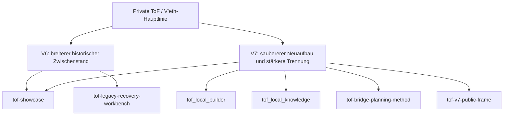

# Projektlinie und öffentliche Repo-Familie

> Deutsch ist die Spiegelversion dieses Dokuments. Der englische Primärtext liegt in `06_project-line.md`.

Dieses Dokument erklärt, wie die öffentlichen Repositories zur größeren privaten ToF / V’eth-Hauptlinie stehen.

> Diese Seite beschreibt Systemkontext und Repo-Beziehungen. Für konkrete Produktkombinationen siehe `01_product_line_DE.md`.

## Warum diese Seite existiert

Ein öffentliches Repository kann leicht zu abstrakt oder zu klein wirken, wenn der größere Kontext unsichtbar bleibt.

Diese Seite soll zeigen, dass die öffentlichen Repositories keine zufälligen Fragmente sind. Sie sind bewusste, öffentlich sichere Ausschnitte einer größeren privaten Systemlinie.

## Hauptprojektlinie

Die breitere ToF / V’eth-Linie wird privat entwickelt.

Öffentlich sollte das Projekt als größere Systemlinie gelesen werden mit:

- Architekturarbeit
- Runtime-Iteration
- Trennung von Schichten und Räumen
- Smoke- und Verifikationskultur
- gestufter Entwicklung über ältere und neuere Versionen hinweg
- kontrollierter öffentlicher Rahmung statt roher interner Offenlegung

## Private Linie, öffentliche Ausschnitte

Die öffentlichen Repositories sind nicht dafür da, das gesamte interne System eins zu eins abzubilden.

Stattdessen zeigen sie ausgewählte Ausschnitte, die sicher veröffentlicht und ehrlich erklärt werden können:

- `tof-showcase` = breite öffentliche Architekturlinie und Einstiegspunkt in das Projekt
- `tof_local_builder` = öffentlicher lokaler Builder-Ausschnitt für lokale GUI-first-Building-Workflows
- `tof_local_knowledge` = öffentlicher on-prem Knowledge-Ausschnitt für Indexierung, Suche und grounded Answers
- `tof-legacy-recovery-workbench` = öffentlicher Recovery-/Werkbank-Methodenausschnitt für älteres vermischtes Material
- `tof-bridge-planning-method` = öffentlicher Vorplanungs-/Bridge-Ausschnitt zwischen vorbereiteten Bausteinen und späteren Zielkandidaten
- `tof-v7-public-frame` = reduzierter V7-Grenzrahmen mit stärkerer Trennungsbetonung

## Lesart der Versionslinie

Eine sinnvolle öffentliche Lesart ist:

- **V6** = breiterer historischer Zwischenstand mit mehr operativer Breite und angesammelten Experimenten
- **V7** = saubererer Neuaufbau mit stärkerer Trennung, engerer Systemlesart und klarerer öffentlicher Rahmung

Das bedeutet nicht, dass die öffentlichen Repositories die vollständige private Runtime einer der beiden Versionen zeigen.

Es bedeutet, dass die öffentliche Seite aus einer realen Projektlinie mit echter Entwicklung hervorgeht.

## Öffentlicher Wachstumspfad

Zwei öffentliche Repositories sollen sichtbar weiter in praktischer Tiefe wachsen:

- `tof_local_builder`
- `tof_local_knowledge`

Diese beiden Repositories sind die klarsten öffentlichen Orte, um lauffähige local-first-Substanz zu zeigen.

Sie sollten daher als aktive öffentliche Ausbauräume gelesen werden und nicht als eingefrorene Schnappschüsse.

## Öffentlich sicheres Diagramm

## Wichtige Grenze

Diese Seite behauptet **nicht**, dass die öffentlichen Repositories das ganze System sind.

Sie zeigt eine sicherere und ehrlichere Lesart:

- es gibt eine größere private Hauptprojektlinie
- die öffentlichen Repositories sind bewusste Ausschnitte
- manche Ausschnitte sind methodenorientiert
- manche Ausschnitte sind lauffähig und produktnah
- öffentliche Erklärung bleibt absichtlich begrenzt

## Wie die öffentlichen Repositories richtig gelesen werden sollten

Nutze die öffentlichen Repositories in dieser Reihenfolge:

1. `tof-showcase` für den breiten Rahmen
2. `tof_local_builder` und `tof_local_knowledge` für konkrete öffentliche Substanz
3. `tof-legacy-recovery-workbench` und `tof-bridge-planning-method` für methodische Disziplin
4. `tof-v7-public-frame` für die engere Grenzlesart

So bleibt die richtige Balance zwischen Erklärung, Glaubwürdigkeit und Sicherheit erhalten.